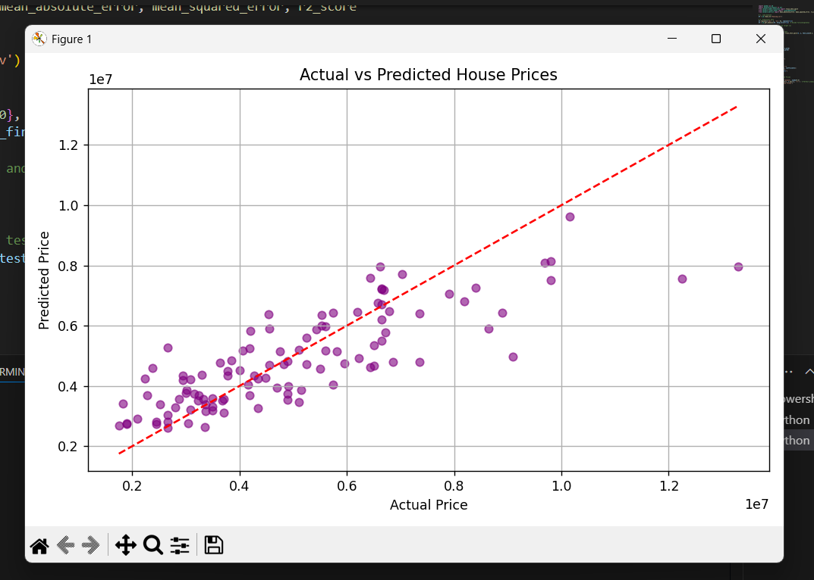
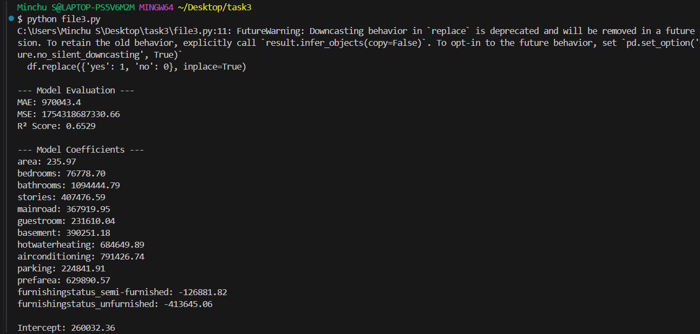

# Housing_linear_reggression
# 🏡 House Price Prediction using Multiple Linear Regression

This project uses a **Multiple Linear Regression** model to predict **house prices** based on various features from a housing dataset.

## 📁 Dataset Used
The dataset used is `Housing.csv`, which contains details like:
- Area (in sq ft)
- Number of bedrooms, bathrooms, stories
- Whether it's on the main road
- Availability of guest room, basement, air conditioning, etc.
- Furnishing status
- And finally, the house price (target value)

## 📊 Objective

To **build a regression model** that can accurately predict house prices using multiple input features.

## 🔧 Technologies & Libraries

- Python 🐍
- Pandas
- Scikit-learn (LinearRegression)
- Matplotlib
## 🧠 What the Model Does

1. Converts categorical values (`yes`/`no`, `furnishingstatus`) into numerical format.
2. Trains a `LinearRegression` model on 80% of the dataset.
3. Tests it on the remaining 20%.
4. Prints out:
   - Evaluation metrics like MAE, MSE, R² score
   - Model coefficients for each feature
5. Plots **Actual vs Predicted Prices** to visualize model performance.
6. 
## 📈 Output Plot

The below graph shows how well the model predicted house prices:

- **X-axis**: Actual prices (from dataset)
- **Y-axis**: Predicted prices (by model)
- **Red dashed line**: Perfect prediction line
- **Purple dots**: Your model’s predictions

> The closer the points to the red line, the better the model is performing!

## 🧾 Sample Output (from Terminal)

## 📌 Conclusion
- The model explains **~65% of the price variation** in the data.
- The coefficients give insights into which features most impact house price.
- This is a strong starting point for learning **regression modeling** in machine learning.

